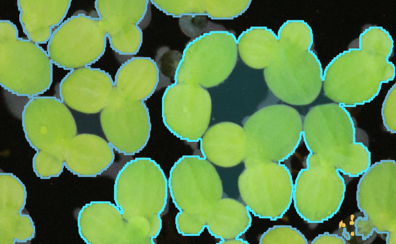
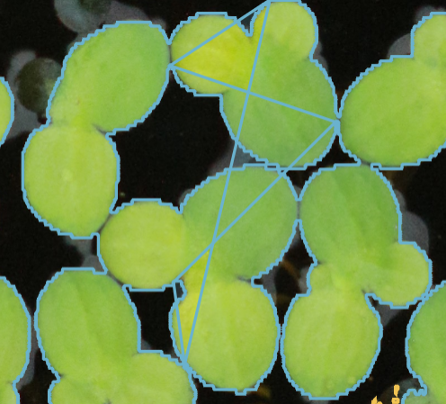
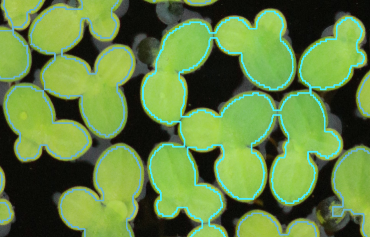
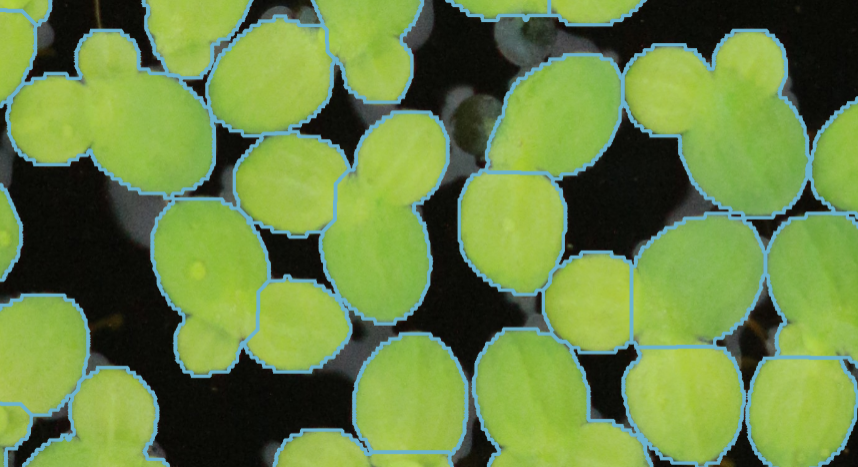

# Supervisely_bitmaps_to_COCO

### Objective

The aim of this project was to transform Supervisely bitmaps into polygons to be imported in Picsellia. Picsellia does 
not support bitmaps so we have to import them as polygons to be modified by annotators.

### Tests

1. First method

This was the simplest method. In this method, the algorithm finds external contours of all polygons and add them into an 
array which gathers all polygons. It does not work properly in this case because background inside polygon is 
represented as polygon.

2. Find inner polygons

This method consists in detecting all polygons via *findContour* method:
- The ones which surrounds the duckweeds.
- The inner polygons which can be interpreted as holes within some duckweeds.

When we retrieve all these polygons, we have class which holes are related to *parent duckweeds*. It can be easily done 
through findContour method, using *RETR_TREE* as *mode* parameter. 
Then, the idea was to extend the parent polygon contour list with child inner polygon contour. That worked well, but it
appeared a link between the last point of the child inner contour and the first point of the parent polygon contour. We 
thought that it was impossible to remove this link because of the polygon property: a polygon has to be closed, so the 
last point is linked to the first point. 
Therefore, we gave up from this idea because, although it was certainly the best way to frame the duckweeds, it was 
impossible to implement with COCO annotations.

3. Use erosion

We noticed that our transfer from bitmaps to polygons was not working because a lot of duckweeds were jointed together.
In fact, the joint between duckweeds create inner background that we do not detect as duckweed surface. 
A new idea was to erode the duckweeds a little bit to remove this juncture between duckweeds and correctly frame duckweeds
using polygons. This idea was not really accurate because we know that if we erode partially a surface, we lose some 
surface. And we figured out that we have to erode a lot to remove this juncture so this technique is not recommended to 
label in a precise way.

We can see that the number of iteration of erosion is too high in this example (kernel: 3x3, iteration number: 10). But
in some cases, this number of iterations is necessary to separate objects. We figure out that this number of iterations 
erode too much surface to overcome reasonable results.

4. Use watershed

This new technique that we used derived from the last idea: we want to remove the juncture between duckweeds in the aim 
of not taking the background holes in our polygons. 
In our experience in image processing, we learnt that when we want to separate some objects which are jointed, we can 
use the watershed technique. We implemented the watershed algorithm to separate duckweeds and it worked well. The only 
drawback in this technique is that it sometimes create more than one polygon in one duckweed. Therefore, it is diffcult 
to read, but this kind of annotation is a good translation of the bitmaps. 

We also tried to use approximation of polygon surrounding the duckweeds to be able to speed the annotations upload to 
Picsellia platform. We figured out that it shrinks the resolution of the annotations and we preferred to stop to use 
this parameter. 

### Annotations upload

Because we used a big COCO annotation file to annotate our dataset (made up of more than 400 items), we were not able 
to upload it from Picsellia platform. Therefore, we have chosen to use Picsellia SDK. For each item that we want to 
annotate, we created a COCO.json annotation file, and we fed our dataset with this new annotation file. 

